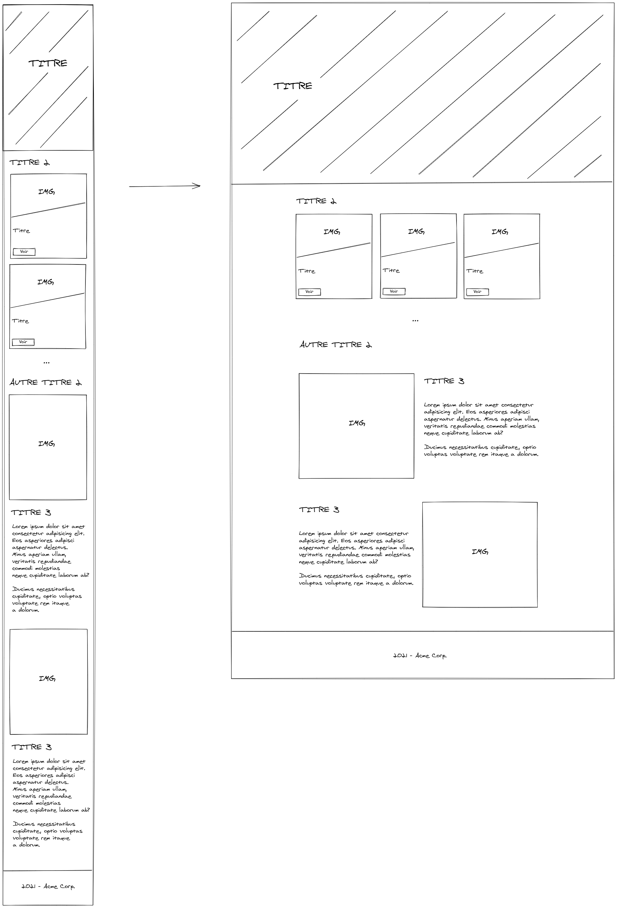

# Studi - RWD (Responsive Web Design)


On veut transformer le prototype suivant en maquette HTML responsive :



## Introduction

Dans notre feuille de styles, on va inscrire quelques règles au niveau du `body` (habituellement, des librairies comme [Normalize](https://necolas.github.io/normalize.css/) font ça de manière plus complète et automatiquement) :

```css
* {
  box-sizing: border-box;
}

body {
  margin: 0;
}
```

Nous utiliserons également une font Google (voir directement dans le code).

Enfin, nous adopterons une approche dite "mobile-first" : les styles seront conçus dans un premier temps pour mobile, afin, dans un second temps, d'élargir le design pour l'adapter aux configurations plus larges.

## Découpage

Procédons dans un premier temps au découpage des principales parties.


Nous pouvons en tirer une structure de base, à partir de laquelle nous construirons nos contenus :

```html
<body>
  <header></header>
  <main></main>
  <footer></footer>
</body>
```

## Header

Pour la partie header, le détail se trouve dans le code.

Pour résumer : on utilise une image d'arrière-plan, que l'on vient adapter suivant la largeur du viewport. Ainsi, on prévoit 3 images de tailles différentes, et avec des media queries, on peut indiquer au navigateur la meilleure à sélectionner.

```css
/* ... */
body > header {
  height: 100vh;
  background-image: linear-gradient(rgba(0, 0, 0, 0.15), rgba(0, 0, 0, 0.05)),
    url(img/bg-mobile.jpg);
  /* ... */
}

@media screen and (min-width: 800px) {
  body > header {
    background-image: linear-gradient(rgba(0, 0, 0, 0.15), rgba(0, 0, 0, 0.05)),
      url("img/bg-medium.jpg");
    /* ... */
  }
}

@media screen and (min-width: 1100px) {
  body > header {
    background-image: linear-gradient(rgba(0, 0, 0, 0.15), rgba(0, 0, 0, 0.05)),
      url("img/bg-desktop.jpg");
    /* ... */
  }
}
```

L'approche "mobile-first" nous invite donc à définir nos styles pour mobile dans un premier temps, puis adapter l'affichage sur certains "breakpoints", ici 800px et 1100px.

> Bootstrap définit davantage de points d'arrêt pour l'adaptation de l'affichage des contenus : [Documentation](https://getbootstrap.com/docs/5.0/layout/breakpoints/#available-breakpoints)

Enfin, concernant le titre principal, de la même manière, avec des media queries, on va distribuer le titre dans l'espace, suivant le support, selon le prototype transmis : centré pour un affichage mobile, puis légèrement à gauche quand on se trouve sur un affichage plus large.

## Cartes dans la première section

On va définir une section regroupant les 3 cartes affichées.

Dans cette section, on définira chaque carte comme un `<article>`, avec une structure identique évidemment.

On définit donc, pour une carte donnée, une zone contenant l'image, découpée en CSS à l'aide de la règle `clip-path`, et une zone de contenu, avec le titre et le bouton "Voir".

Enfin, pour organiser les cartes, on va utiliser `flexbox`. Ceci nous permettra de les distribuer verticalement ou horizontalement, selon la largeur du viewport.

## Sections "d'introduction" ou "présentation"

On va définir une classe CSS "intro" qu'on appliquera à tous les blocs présentant une image et un texte d'introduction.

Toujours dans une optique "mobile-first", nous fixons les règles suivantes :

```css
.intro {
  display: flex;
  flex-direction: column;
  margin-bottom: 4rem;
  gap: 1rem;
  align-items: center;
}

@media screen and (min-width: 800px) {
  /* ... */

  .intro {
    flex-direction: row;
    align-items: flex-start;
  }

  .intro:nth-of-type(odd) {
    flex-direction: row-reverse;
  }

  .intro > * {
    flex-basis: 50%;
  }
}
```

A partir du breakpoint "medium", soit 800px, on les fait passer en ligne.

> Avec la pseudo-classe `nth-of-type(odd)`, on peut, à partir de 800px, indiquer au navigateur qu'on souhaite inverser l'affichage une fois sur deux. Pas besoin d'inverser les éléments dans les sections d'introduction au niveau du HTML donc

## Footer

Le footer est tout à fait classique dans sa construction, il n'est probablement pas nécessaire de s'attarder dessus.

## Les images

> Note : pour tester l'affichage des images et voir dans l'inspecteur d'éléments les images choisies par le navigateur, utilisez Mozilla Firefox en mode navigation privée

Pour chaque image affichée dans la page, nous définissons :

- Des media queries adaptées pour les images d'arrière-plan, car elles sont gérées via CSS
- Les attributs `srcset` et `sizes` pour les balises `img`

```html

```

Dans l'attribut `srcset`, on indique au navigateur l'ensemble des sources disponibles pour l'image qu'on veut afficher, avec leur largeur (`370w` par exemple indique que l'image fait 370pw de large).

Ensuite, avec `sizes`, on indique via une media query qu'à partir de 450px de large, on voudra tenter un affichage de 640px, et sinon 370px. Ainsi, le navigateur sera en mesure de sélectionner la source la plus adaptée.

Cela permet au navigateur de sélectionner la version la plus adaptée pour le terminal affichant la page.

Cela implique de disposer de plusieurs version d'une même image, avec des dimensions différentes.

Dans le cas d'une maquette, nous pouvons réaliser assez rapidement différentes versions des images de test que nous utilisons.

Nous pouvons partir du principe qu'ensuite, lors de la réalisation de l'application intégrant ce design, le développeur pourra intégrer aux fonctionnalités un module de génération de miniatures automatisé, intervenant par exemple lors de l'upload d'une image.

L'essentiel est bien entendu qu'il dispose des différentes tailles à gérer.

L'intérêt pour nous est bien sûr d'optimiser les ressources chargées par le navigateur, et donc la taille totale de la page.

Par exemple, en version mobile :


En version medium, si on redimensionne la zone d'affichage :


| Terminal | Taille des contenus |
| -------- | ------------------- |
| Mobile   | 193.08kB            |
| Bureau   | 461.96kB            |
